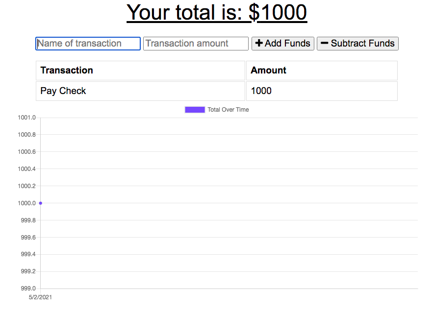
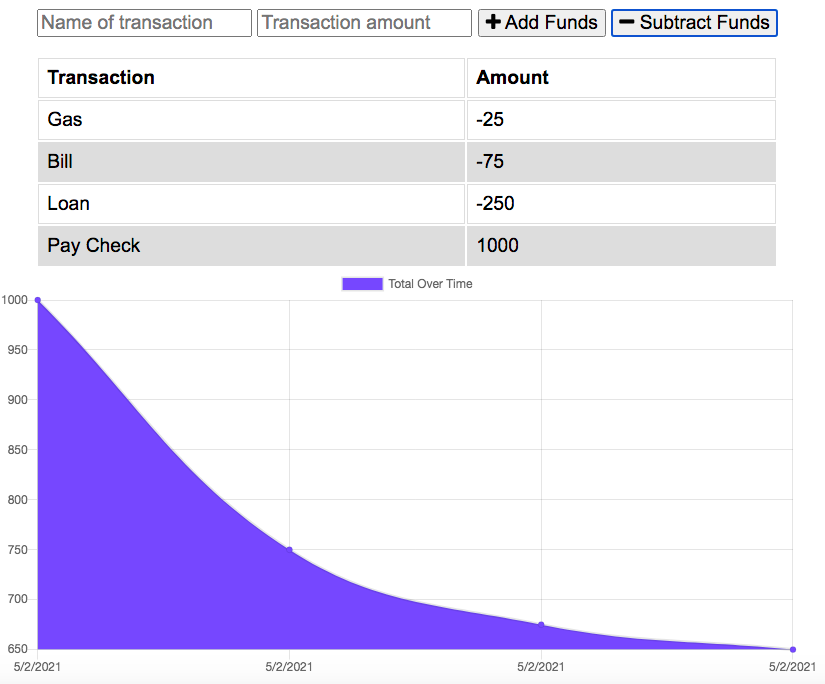
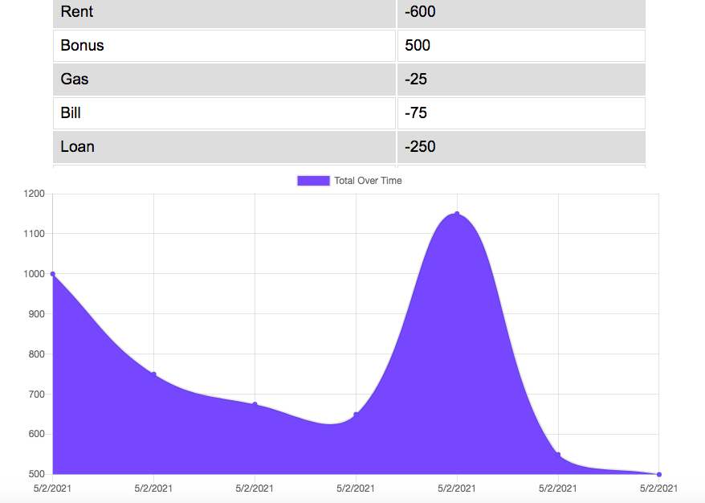

# Budget Tracker

## Description
An app giving users a fast and easy way to track their money and allowing them to access their financial information at any time offline.
Updated an existing budget tracker application to allow for offline access and functionality. The user will be able to add expenses and deposits to their budget with or without a connection. If the user enters transactions offline, the total should be updated when they're brought back online.

## Heroku
Deployed App on [Heroku](https://serene-garden-74212.herokuapp.com/)

## Table of Contents
* [Usage](#usage)

* [Credits](#contributing)

* [Questions](#questions)
  

## Images

  

## Technologies

* JavaScript
* Node
* Express
* Mongoose

## Usage
A social media startup wants an API for their social network that uses a NoSQL database
so the website can handle large amounts of unstructured data.

## Deployment

Link to repo on [GitHub](https://github.com/Rachel-Reidenga/PWA-budget-tracker/tree/master)

### Contributing

[w3schools.com](https://www.w3schools.com/)

[stackoverflow](https://stackoverflow.com/)

Shout out to Tanetta J, Monica H and Paul C

### Questions
If there are any questions please contact me [Rachel-Reidenga](https://github.com/Rachel-Reidenga)